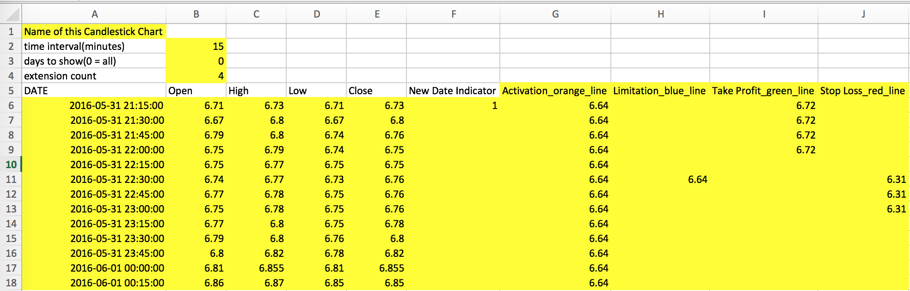

## Specification for Generic Candlestick Chart ##
**Generic Candlestick** is a program to generate candlestick chart from a .csv file. User can add some **line extension** to the chart. The output is a html file

###Function
1. Generate candlestick chart
2. Add line extension

###Usage
The input must be a csv file in a certain format. For now, put the csv file and the code in the same directory and run the code. Here is an example

> 

1. Row 1 define the title of the chart
2. Row 2 indicate the time interval between each candle. The unit must be **minute**
3. Row 3 indicate how many days the user want to show. If it is 0, the chart will show all the data. If not, it will show exactly that amount of dates from the end of the data. For example, if it is 5, the chart will show the last 5 days.
4. Row 4 is the count of extension. In this case, the extension data is from *G* to *J* so the count is 4.
5. Row 5 is the name of columns. **DO NOT** change the six names which is from *DATE* to *New Date Indicator*. 
6. Column 1 is the date and time of the candle. User must save the date like **"2016-05-31 21:15:00"**
7. Column 2 to 5 are the *open, high, low, close* data
8. Column 6 is important if user wants to show certain amount of dates. Set this column to **1** if the data entry is the first data of a business day. If user just wants to show all the data, this column can be leave empty.
9. Column 7 and the following are the extensions. The name of the data should be defined as `name_color_line type`. Use can choose `color` and `line type` from the table below. Each data in this column will be shown in a time interval period. In this case, that is 15 minutes.

###Output
For now, the output is a html file like below
> 

###Color and line type table

<table>
  <tr>
    <th>Color</th>
    <th>Line Type</th>
  </tr>
  <tr>
    <td>red</td>
    <td>line</td>
  </tr>
  <tr>
    <td>green</td>
    <td>dash</td>
  </tr>
  <tr>
    <td>yellow</td>
    <td>dot</td>
  </tr>
  <tr>
    <td>blue</td>
    <td></td>
  </tr>
  <tr>
    <td>purple</td>
    <td></td>
  </tr>
  <tr>
    <td>orange</td>
    <td></td>
  </tr>
  <tr>
    <td>black</td>
    <td></td>
  </tr>
</table>
