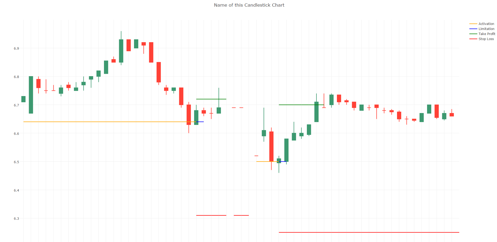

## Specification for Generic Candlestick Chart ##
---
**Generic Candlestick** is a program to generate candlestick chart from a .csv file. User can add some **line extension** to the chart. The output is a html file

### Function
1. Generate candlestick chart(html file)
2. Add line extension

### Usage
The input must be a csv file in a certain format. For now, put the csv file and the code in the same directory and run the code. Here is an example. **Note that user can only change the data in the yellow area**

1. Row 1 define the title of the chart. If the user do not enter anything here, the program will name the chart *'Candlestick'*
2. Row 2 indicate the `time interval` between each candle. This data must be exactly the same as the time intervel between each candle. The program will take this time interval to generate candles. The unit must be **minute**.
3. Row 3 indicate how many days the user want to show. If it is 0, the chart will show all the data. If not, it will show exactly that amount of dates from the end of the data. For example, if it is 5, the chart will show the last 5 days. If the use enter a invalid data(such as *-1*), the chart will show all the data. 
4. Row 4 is the count of extension. User can add as much as extensions they want and each extension should be one column. In this case, the extension data is from *column G* to *column J* so the count is 4.
5. Row 5 is the name of columns. **DO NOT** change the first six names which is from *DATE* to *New Date Indicator*. 
6. Column A is the `datetime` of the candle. User must save the date using the certain format **"2016-05-31 21:15:00"** (yyyy-mm-dd hh:mm:ss). If the format of the datetime is incorrect, then the program will exit.
7. Column B to E are the `open`, `high`, `low`, `close` data. Just input data here and note that the `high` must be bigger than `low` otherwise the program will exit.
8. **Column F is important** if user wants to show certain amount of dates. Set this column to **1** if the data entry is the first data of a business day. If user just wants to show all the data, this column can be left empty.
9. Column G and the following are the extensions. The name of the data should be defined as `name_color_line type`. Use can choose `color` and `line type` from the table below. Each data in this column will be shown in a time interval period. In this case, that is 15 minutes. If the use does not input the name here, like ' _ _ ', the program will assign a default `name`, `color` and `line type` for this extension.

### Output
For now, the output is a html file like below. User can use Chrome to open it. The four lines are four extensions.

### Color and line type table

<table>
  <tr>
    <th>Color</th>
    <th>Line Type</th>
  </tr>
  <tr>
    <td>red</td>
    <td>line</td>
  </tr>
  <tr>
    <td>green</td>
    <td>dash</td>
  </tr>
  <tr>
    <td>yellow</td>
    <td>dot</td>
  </tr>
  <tr>
    <td>blue</td>
    <td></td>
  </tr>
  <tr>
    <td>purple</td>
    <td></td>
  </tr>
  <tr>
    <td>orange</td>
    <td></td>
  </tr>
  <tr>
    <td>black</td>
    <td></td>
  </tr>
</table>
